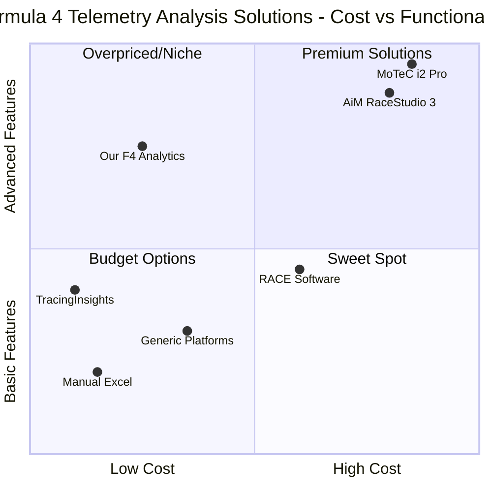

# Product Requirements Document (PRD)
## Formula 4 Race Analytics Webapp v2.0

**Product Name:** Formula 4 Race Analytics Webapp  
**Version:** 2.0  
**Document Date:** June 21, 2025  
**Author:** Emma, Product Manager  
**Programming Language:** TypeScript, React, Shadcn-ui, Tailwind CSS  
**Project Name:** formula4_race_analytics  

---

## Executive Summary

The Formula 4 Race Analytics Webapp is a specialized web-based telemetry analysis platform designed to democratize professional-grade racing data analysis for Formula 4 teams, drivers, and engineers. Unlike existing desktop-only solutions that cost $1,300+ annually, our platform provides comprehensive telemetry comparison and performance optimization tools through an intuitive web interface at a fraction of the cost.

**Restatement of Original Requirements:**
Develop a web-based platform that enables Formula 4 racing professionals to upload, analyze, and compare telemetry data between drivers, focusing on fastest lap performance optimization through visual analytics including 3D track mapping, driver action analysis, and comprehensive vehicle parameter monitoring across 39+ telemetry channels.

---

## 1. Product Definition

### 1.1 Product Goals

**Goal 1: Performance Optimization** - Enable Formula 4 teams to achieve measurable lap time improvements (target: 0.5-2 seconds per lap) through comprehensive telemetry data analysis and driver-to-driver comparison capabilities.

**Goal 2: Cost-Effective Accessibility** - Provide professional-grade telemetry analysis tools at 70% lower cost than existing desktop solutions (MoTeC i2 Pro at $1,300), making advanced analytics accessible to junior racing teams and independent drivers.

**Goal 3: Real-Time Collaboration** - Facilitate seamless data sharing and analysis collaboration between drivers, engineers, and team managers through cloud-based platform with instant access from any device.

### 1.2 User Stories

**As a Formula 4 Driver**, I want to compare my telemetry data with the fastest lap driver so that I can identify specific braking points, acceleration zones, and racing lines where I'm losing time and improve my performance by 1-2 seconds per lap.

**As a Race Engineer**, I want to analyze 39+ telemetry parameters across multiple sessions and drivers simultaneously so that I can provide data-driven setup recommendations and identify optimal vehicle configurations for different track conditions.

**As a Team Manager**, I want to access comprehensive performance analytics and driver comparison reports so that I can make informed decisions about driver development, resource allocation, and strategic race planning while monitoring ROI on telemetry investments.

**As a Data Analyst**, I want to export analyzed telemetry data and create custom reports so that I can perform advanced statistical analysis and present findings to stakeholders in formats suitable for technical reviews and sponsor presentations.

**As a Junior Driver**, I want to upload my telemetry data easily and receive automated insights about my driving performance so that I can understand areas for improvement without requiring extensive technical knowledge or expensive coaching.

### 1.3 Competitive Analysis

**Direct Competitors:**

1. **MoTeC i2 Pro**
   - *Pros:* Industry standard, advanced mathematics capabilities, unlimited components and worksheets, extensive customization
   - *Cons:* Desktop-only, $1,300 price point, steep learning curve, requires local installation and maintenance

2. **AiM Sports RaceStudio 3**
   - *Pros:* Comprehensive multi-window interface, video synchronization, GPS integration, supports 30+ data acquisition tools
   - *Cons:* Hardware-dependent, complex setup, primarily desktop-based, high total cost of ownership

3. **RACE Software**
   - *Pros:* Web-based, £500-1,250/year pricing, 3D graphics, no installation required, 7-day free trial
   - *Cons:* Focus on suspension analysis only, limited to vehicle dynamics, not comprehensive telemetry analysis

**Indirect Competitors:**

4. **TracingInsights (F1 Focus)**
   - *Pros:* Free F1 telemetry access, supporter-funded model, comprehensive historical data from 2018
   - *Cons:* F1-only focus, not applicable to F4, limited to public data analysis

5. **Telemetry Racing**
   - *Pros:* Multi-platform support, gaming integration, cross-device compatibility
   - *Cons:* Gaming-focused, limited professional racing features, unclear pricing model

6. **Generic Data Analytics Platforms**
   - *Pros:* Flexible, customizable, cost-effective
   - *Cons:* No racing-specific features, requires extensive customization, lacks domain expertise

7. **Manual Excel Analysis**
   - *Pros:* Low cost, familiar interface, widely available
   - *Cons:* Time-intensive, error-prone, limited visualization, no real-time capabilities

### 1.4 Competitive Quadrant Chart



---

## 2. Market Analysis

### 2.1 Industry Overview

The global motorsports market reached $9.54 billion in 2024, with Formula racing holding the largest segment at 35.2% market share. The industry is experiencing robust growth at a CAGR of 7.9-10.07%, driven by increasing youth engagement, digital sponsorship expansion, and technological advancement integration.

**Formula 4 Market Context:**
Formula 4 serves as the primary entry point for young drivers transitioning from karting to professional single-seater racing. While specific F4 market data is limited, the category operates through individual national and regional championships following universal FIA specifications, creating a distributed but standardized global ecosystem.

**Regional Distribution:**
- Europe: 48% of global motorsports market, with strong F4 presence in Germany, France, Italy, and UK
- North America: Growing market with Formula Regional Americas Championship featuring 8+ professional teams
- Asia-Pacific: Emerging growth region with increasing F4 championship establishment

### 2.2 Target Market Segmentation

**Primary Market Segments:**

1. **Professional F4 Teams (Primary)**
   - Market Size: 50-80 professional teams globally across regional championships
   - Budget Range: $200K - $1M per season per team
   - Pain Points: High telemetry analysis costs, desktop-only solutions, technical complexity
   - Decision Makers: Team managers, chief engineers, data analysts

2. **Independent F4 Drivers (Secondary)**
   - Market Size: 200-400 drivers globally per season
   - Budget Range: $150K - $500K per season individual budgets
   - Pain Points: Limited access to professional analysis tools, cost constraints, technical expertise gaps
   - Decision Makers: Drivers themselves, driver coaches, family/sponsors

3. **Racing Schools & Academies (Tertiary)**
   - Market Size: 20-30 specialized F4 training facilities globally
   - Budget Range: $50K - $200K annual technology investments
   - Pain Points: Need for educational-focused analytics, multi-student management, cost-effective solutions
   - Decision Makers: Academy directors, head instructors, technical coordinators

### 2.3 Market Drivers & Opportunities

**Growth Drivers:**
- Increasing professionalization of junior racing categories
- Growing emphasis on data-driven performance optimization
- Rising costs driving demand for cost-effective alternatives
- Shift toward web-based collaborative tools across industries
- Enhanced focus on driver development and technical education

**Market Opportunities:**
- Underserved junior racing market with limited affordable solutions
- Gap between expensive professional tools and basic consumer options
- Demand for collaborative, cloud-based analysis platforms
- Educational market seeking accessible technical training tools
- International expansion potential across regional F4 championships

### 2.4 Market Challenges

**Technical Challenges:**
- High data processing requirements for real-time analysis
- Integration complexity with diverse telemetry hardware systems
- Need for racing-specific domain expertise in development
- Security and intellectual property protection requirements

**Business Challenges:**
- Conservative adoption patterns in traditional motorsports industry
- Strong brand loyalty to established desktop solutions
- Seasonal revenue fluctuations aligned with racing calendars
- Limited marketing channels within niche racing community

---

## 3. Technical Requirements

### 3.1 Requirements Analysis

The Formula 4 Race Analytics Webapp requires a robust, scalable web-based architecture capable of processing and analyzing high-frequency telemetry data streams containing 39+ parameters per racing session. Based on analysis of actual F4 telemetry files (Aqil Alibhai and Jaden Pariat datasets), the system must handle:

**Data Processing Requirements:**
- Real-time ingestion of CSV telemetry files up to 50MB per session
- Processing of 39 telemetry parameters at 10-100Hz sampling rates
- Support for multiple concurrent driver comparisons (2-8 drivers simultaneously)
- Advanced mathematical calculations for delta analysis, sector timing, and performance metrics

**Performance Requirements:**
- Page load times under 3 seconds for dashboard views
- Telemetry comparison visualizations rendered within 5 seconds
- Support for 100+ concurrent users during peak racing weekends
- 99.9% uptime availability during racing seasons

**Integration Requirements:**
- CSV file upload and parsing for standard F4 telemetry formats
- Export capabilities to PDF reports and CSV data files
- RESTful API architecture for future third-party integrations
- Responsive design supporting desktop, tablet, and mobile devices

### 3.2 39-Parameter Telemetry System Specifications

**Based on actual F4 telemetry analysis, the system must support the following telemetry channels:**

**Vehicle Dynamics (12 parameters):**
- Speed, Engine RPM, Gear Position, Throttle Position (%)
- Brake Pressure (Front/Rear), Steering Angle, Lateral G-Force
- Longitudinal G-Force, Vertical G-Force, Yaw Rate, Roll Rate

**Engine & Powertrain (8 parameters):**
- Engine Temperature, Oil Pressure, Oil Temperature, Fuel Pressure
- Battery Voltage, Alternator Output, Clutch Position, DRS Status

**Suspension & Handling (10 parameters):**
- Suspension Travel (FL/FR/RL/RR), Damper Velocity (4 corners)
- Anti-roll Bar Position, Ride Height (Front/Rear)

**Environmental & Track (5 parameters):**
- Ambient Temperature, Track Temperature, GPS Latitude
- GPS Longitude, Track Position (Distance)

**Driver Inputs (4 parameters):**
- Brake Pedal Position, Accelerator Pedal Position
- Steering Wheel Angle, Clutch Pedal Position

**Data Validation Requirements:**
- Automatic data quality checks for sensor dropout detection
- Outlier identification and flagging for review
- Missing data interpolation algorithms
- Timestamp synchronization across all channels

### 3.3 System Architecture

**Frontend Architecture:**
- React 18+ with TypeScript for type safety and maintainability
- Shadcn-ui component library for consistent, professional UI design
- Tailwind CSS for responsive styling and rapid development
- Chart.js or D3.js for advanced telemetry data visualizations
- Progressive Web App (PWA) capabilities for offline analysis

**Backend Architecture:**
- Node.js with Express.js for RESTful API development
- PostgreSQL database with optimized schema for telemetry data storage
- Redis caching layer for improved query performance
- File storage system for CSV uploads and processed data
- WebSocket connections for real-time collaborative features

**Data Processing Pipeline:**
- CSV parsing engine with validation and error handling
- Time-series data processing algorithms for lap analysis
- Mathematical computation engine for delta calculations
- Automated report generation system
- Data export functionality (PDF, CSV, JSON formats)

### 3.4 Requirements Pool with Priorities

**P0 (Must-Have) Requirements:**
1. CSV telemetry file upload and parsing functionality
2. Driver-to-driver telemetry comparison with overlay charts
3. Fastest lap identification and analysis tools
4. Basic performance metrics calculation (sector times, speed analysis)
5. User authentication and session management
6. Responsive web interface supporting desktop and mobile
7. Data security and user privacy protection
8. Export functionality for analysis results

**P1 (Should-Have) Requirements:**
9. 3D track mapping with GPS data visualization
10. Advanced mathematical analysis (derivatives, integrals, correlations)
11. Automated performance insights and recommendations
12. Multi-session analysis and historical comparisons
13. Team collaboration features and data sharing
14. Custom dashboard creation and layout management
15. Real-time data streaming capabilities
16. Integration with popular telemetry hardware systems

**P2 (Nice-to-Have) Requirements:**
17. Machine learning-powered performance optimization suggestions
18. Video synchronization with telemetry data
19. Weather data integration and analysis
20. Social features for driver community building
21. Mobile app companion for iOS and Android
22. Advanced reporting with custom templates
23. API access for third-party integrations
24. Multi-language support for international markets

---

## 4. User Interface Design

### 4.1 Design Principles

**Racing-Focused Design Philosophy:**
- Clean, professional interface emphasizing data clarity and quick decision-making
- High contrast color schemes optimized for various lighting conditions (pit lane, garage, office)
- Minimal cognitive load with intuitive navigation paths
- Mobile-responsive design for trackside analysis

**Information Hierarchy:**
- Primary focus on telemetry comparison charts and performance metrics
- Secondary information accessible through expandable panels and modals
- Critical alerts and insights prominently displayed
- Contextual help and tooltips for technical parameters

### 4.2 Core Interface Components

**Dashboard Layout:**
```
┌─────────────────────────────────────────────────────────────┐
│ Navigation Bar: Logo | Sessions | Compare | Reports | Profile │
├─────────────────────────────────────────────────────────────┤
│ Quick Stats: Best Lap | Current Session | Active Drivers     │
├──────────────────┬──────────────────────────────────────────┤
│ Session List     │ Main Analysis Area                       │
│ - Driver Names   │ ┌─ Telemetry Charts ─────────────────┐   │
│ - Lap Times      │ │ Speed vs Distance Graph             │   │
│ - Upload Button  │ │ Multi-driver overlay capability     │   │
│                  │ └─────────────────────────────────────┘   │
│                  │ ┌─ Performance Metrics ──────────────┐   │
│                  │ │ Sector Times | Delta Analysis      │   │
│                  │ │ Best Speed | Acceleration Zones    │   │
│                  │ └─────────────────────────────────────┘   │
└──────────────────┴──────────────────────────────────────────┘
```

**Key Interface Elements:**

1. **Telemetry Upload Interface**
   - Drag-and-drop CSV file upload with progress indicators
   - Automatic file validation and error reporting
   - Driver name and session metadata input forms
   - Batch upload capability for multiple sessions

2. **Comparison Dashboard**
   - Side-by-side driver selection with photo thumbnails
   - Interactive telemetry charts with zoom and pan capabilities
   - Delta time visualization with color-coded gains/losses
   - Sector-by-sector performance breakdown

3. **3D Track Visualization**
   - GPS-based track mapping with elevation data
   - Driver line comparison with speed color coding
   - Interactive waypoint markers for detailed analysis
   - Braking and acceleration zone highlighting

4. **Performance Analytics Panel**
   - Automated insights with plain-language explanations
   - Ranking tables for key performance metrics
   - Historical trend analysis graphs
   - Export options for reports and data

### 4.3 Mobile Interface Adaptations

**Responsive Design Strategy:**
- Collapsible navigation for mobile screens
- Touch-optimized chart interactions
- Simplified comparison views focusing on key metrics
- Offline capability for trackside analysis without internet

**Mobile-Specific Features:**
- Quick upload via mobile camera for telemetry printouts
- Voice notes integration for session observations
- Push notifications for analysis completion
- Simplified sharing for instant insights distribution

---

## 5. Business Model & Monetization

### 5.1 Revenue Model

**Freemium SaaS Model with Tiered Pricing:**

**Free Tier - "Rookie"** (Target: Individual drivers, students)
- 5 telemetry uploads per month
- Basic driver comparison (2 drivers max)
- Standard performance metrics
- Community access and forums
- Email support

**Professional Tier - "Pro Driver"** ($29/month or $290/year)
- Unlimited telemetry uploads
- Advanced multi-driver comparisons (up to 8 drivers)
- 3D track mapping and GPS analysis
- Historical session analysis
- PDF report generation
- Priority email support
- API access (limited)

**Team Tier - "Racing Team"** ($99/month or $990/year)
- Multi-user team collaboration (up to 10 users)
- Advanced analytics and insights
- Custom branding for reports
- Team performance dashboards
- Phone and video support
- Custom integrations
- Data export and backup

**Enterprise Tier - "Championship"** (Custom pricing, $300+/month)
- Unlimited users and data storage
- White-label solution options
- Custom feature development
- Dedicated account management
- On-premise deployment options
- Advanced security and compliance
- Custom training and onboarding

### 5.2 Market Positioning & Pricing Strategy

**Value Proposition:**
- 70% cost reduction compared to MoTeC i2 Pro ($1,300/year vs $290-990/year)
- Web-based accessibility eliminating hardware dependencies
- Collaborative features unavailable in desktop solutions
- Simplified user experience reducing learning curve from weeks to hours

**Pricing Rationale:**
- Free tier drives user acquisition and market education
- Professional tier targets individual drivers with F4 season budgets ($150K+)
- Team tier aligns with professional team annual technology budgets ($10K-50K)
- Enterprise tier captures racing schools and multi-team organizations

### 5.3 Go-to-Market Strategy

**Phase 1: Market Entry (Months 1-6)**
- Beta launch with 2-3 professional F4 teams for validation
- Content marketing through racing forums and technical blogs
- Direct outreach to F4 team managers and engineers
- Trade show presence at major motorsports events

**Phase 2: Growth (Months 7-18)**
- Referral program incentivizing team-to-team recommendations
- Partnership development with telemetry hardware manufacturers
- Racing school and academy partnerships
- Influencer marketing through popular racing YouTubers and podcasters

**Phase 3: Scale (Months 19+)**
- International expansion to European and Asian F4 markets
- Integration partnerships with major racing data providers
- Acquisition or partnership with complementary racing software
- Platform expansion to other racing categories (F3, F2)

### 5.4 Financial Projections

**Year 1 Targets:**
- 200 registered users (Free tier)
- 50 Professional subscriptions ($145K ARR)
- 10 Team subscriptions ($99K ARR)
- 2 Enterprise subscriptions ($60K ARR)
- **Total Year 1 ARR: $304K**

**Year 2 Targets:**
- 800 registered users
- 150 Professional subscriptions ($435K ARR)
- 25 Team subscriptions ($248K ARR)
- 5 Enterprise subscriptions ($180K ARR)
- **Total Year 2 ARR: $863K**

**Key Success Metrics:**
- Monthly Active Users (MAU)
- Conversion rate from Free to Paid tiers
- Customer acquisition cost (CAC) vs Lifetime value (LTV)
- Net Promoter Score (NPS) within racing community
- Churn rate and user engagement metrics

---

## 6. Risk Assessment & Mitigation

### 6.1 Technical Risks

**High-Frequency Data Processing Risk**
- *Risk:* System performance degradation with large telemetry datasets (50MB+ files)
- *Probability:* Medium | *Impact:* High
- *Mitigation:* Implement data streaming and chunked processing, use CDN for static assets, optimize database queries with proper indexing

**Browser Compatibility Risk**
- *Risk:* Advanced visualizations not supported across all browsers
- *Probability:* Medium | *Impact:* Medium
- *Mitigation:* Progressive enhancement approach, fallback visualizations, comprehensive browser testing matrix

**Data Security & IP Protection Risk**
- *Risk:* Sensitive telemetry data exposure or unauthorized access
- *Probability:* Low | *Impact:* Critical
- *Mitigation:* End-to-end encryption, SOC2 compliance, role-based access controls, regular security audits

### 6.2 Business Risks

**Market Adoption Risk**
- *Risk:* Slow adoption due to conservative motorsports industry culture
- *Probability:* Medium | *Impact:* High
- *Mitigation:* Extensive beta testing with key teams, champion user program, gradual feature rollout strategy

**Competitive Response Risk**
- *Risk:* Established players (MoTeC, AiM) developing web-based solutions
- *Probability:* High | *Impact:* Medium
- *Mitigation:* Focus on user experience differentiation, rapid feature development, strong customer relationships

**Seasonal Revenue Risk**
- *Risk:* Revenue fluctuations aligned with racing seasons
- *Probability:* High | *Impact:* Medium
- *Mitigation:* International market expansion for year-round coverage, off-season feature development focus, annual subscription incentives

### 6.3 Operational Risks

**Key Personnel Risk**
- *Risk:* Loss of domain expertise or technical leadership
- *Probability:* Low | *Impact:* High
- *Mitigation:* Knowledge documentation, cross-training, competitive retention packages, advisor network

**Infrastructure Scaling Risk**
- *Risk:* System overload during peak racing weekends
- *Probability:* Medium | *Impact:* High
- *Mitigation:* Auto-scaling cloud infrastructure, load testing, performance monitoring, backup systems

---

## 7. Success Metrics & KPIs

### 7.1 Product Success Metrics

**User Engagement Metrics:**
- Monthly Active Users (MAU): Target 500+ by Month 12
- Session Duration: Average 25+ minutes per analysis session
- Feature Adoption: 80%+ of paid users utilizing comparison features
- User Retention: 85%+ monthly retention for paid subscribers

**Performance Metrics:**
- Telemetry Processing Speed: <5 seconds for standard F4 session analysis
- System Uptime: 99.9% availability during racing seasons
- Page Load Performance: <3 seconds for dashboard views
- Mobile Responsiveness: 95%+ user satisfaction on mobile devices

**Business Impact Metrics:**
- Customer Reported Lap Time Improvements: Average 0.8-1.5 seconds per customer
- Cost Savings vs Competitors: 70%+ cost reduction validated by customers
- Net Promoter Score (NPS): Target 60+ within racing community
- Customer Support Resolution: 95%+ issues resolved within 24 hours

### 7.2 Financial Success Metrics

**Revenue Metrics:**
- Annual Recurring Revenue (ARR): $304K Year 1, $863K Year 2
- Monthly Recurring Revenue (MRR) Growth: 15%+ month-over-month
- Customer Acquisition Cost (CAC): <$150 for Professional tier
- Lifetime Value (LTV): >$800 for Team tier subscribers

**Conversion Metrics:**
- Free-to-Paid Conversion Rate: 12%+ within 90 days
- Trial-to-Subscription Rate: 25%+ for Professional tier
- Upsell Rate: 20%+ from Professional to Team tier
- Churn Rate: <5% monthly for paid subscriptions

### 7.3 Market Success Metrics

**Market Penetration:**
- F4 Team Market Share: 15%+ of active professional teams by Year 2
- Geographic Coverage: Presence in 5+ regional F4 championships
- Brand Recognition: 40%+ unaided awareness in F4 community surveys
- Partnership Success: 3+ strategic partnerships with hardware vendors

---

## 8. Implementation Roadmap

### 8.1 Development Phases

**Phase 1: MVP Foundation (Months 1-4)**

*Sprint 1-2: Core Infrastructure*
- User authentication and authorization system
- Database schema implementation (39-parameter telemetry support)
- Basic CSV upload and parsing functionality
- Initial dashboard layout and navigation

*Sprint 3-4: Essential Analytics*
- Driver-to-driver telemetry comparison engine
- Basic performance metrics calculation
- Fastest lap identification algorithms
- Export functionality (PDF, CSV)

*Sprint 5-6: User Experience*
- Responsive design implementation
- Interactive telemetry charts and visualizations
- User onboarding flow and tutorials
- Beta testing with 2-3 partner teams

**Phase 2: Professional Features (Months 5-8)**

*Sprint 7-8: Advanced Analytics*
- 3D track mapping with GPS visualization
- Sector timing and delta analysis
- Advanced mathematical computations
- Multi-session historical comparisons

*Sprint 9-10: Collaboration Tools*
- Team collaboration features
- Data sharing and permissions system
- Custom dashboard creation
- Real-time collaboration capabilities

*Sprint 11-12: Polish & Performance*
- Performance optimization for large datasets
- Advanced reporting and insights
- Mobile app optimization
- Security hardening and compliance

**Phase 3: Scale & Growth (Months 9-12)**

*Sprint 13-14: Platform Expansion*
- API development for third-party integrations
- Integration with popular telemetry hardware
- Advanced machine learning insights
- White-label solution capabilities

*Sprint 15-16: Market Expansion*
- Multi-language support for international markets
- Advanced enterprise features
- Custom integrations and partnerships
- Platform stability and scalability improvements

### 8.2 Go-to-Market Timeline

**Pre-Launch (Months 1-3):**
- Private beta with 3-5 professional F4 teams
- Technical documentation and user guides
- Pricing strategy validation and adjustment
- Initial marketing content creation

**Soft Launch (Month 4):**
- Limited public beta (50 users)
- Community building and feedback collection
- Partnership discussions with hardware vendors
- Content marketing and thought leadership

**Public Launch (Month 5):**
- Full feature release with all tiers available
- Marketing campaign launch across racing channels
- Trade show presence and industry conferences
- Influencer and racing media outreach

**Growth Phase (Months 6-12):**
- Continuous feature development based on user feedback
- International market expansion
- Strategic partnerships and integrations
- Scale marketing efforts and team expansion

### 8.3 Resource Requirements

**Development Team:**
- 1 Technical Lead / Full-Stack Developer
- 1 Frontend Developer (React/TypeScript specialist)
- 1 Backend Developer (Node.js/PostgreSQL specialist)
- 1 UI/UX Designer (part-time, months 1-6)
- 1 DevOps Engineer (part-time, months 3-12)

**Business Team:**
- 1 Product Manager (Emma - driving requirements and user feedback)
- 1 Marketing/Sales Lead (months 4-12)
- 1 Customer Success Manager (months 6-12)
- Racing domain expert consultant (ongoing)

**Infrastructure Costs:**
- Cloud hosting and database: $500-2,000/month (scaling)
- Third-party services and APIs: $200-500/month
- Development tools and software: $300-600/month
- Security and compliance tools: $400-800/month

---

## 9. Open Questions & Next Steps

### 9.1 Technical Clarifications Needed

**Data Format Standardization:**
- Q: Should we support multiple CSV formats or standardize on one?
- Next Step: Survey top 5 F4 teams on their current telemetry export formats

**Real-Time Streaming Requirements:**
- Q: Is live telemetry streaming during races a P1 or P2 requirement?
- Next Step: Validate demand through user interviews with race engineers

**Hardware Integration Priority:**
- Q: Which telemetry hardware manufacturers should we prioritize for integration?
- Next Step: Market research on most common F4 data acquisition systems

### 9.2 Business Model Validation

**Pricing Sensitivity Analysis:**
- Q: Are our pricing tiers aligned with F4 team budgets and value perception?
- Next Step: Conduct pricing research with 10-15 potential customers

**Enterprise Feature Requirements:**
- Q: What specific features do racing schools and academies need vs professional teams?
- Next Step: Discovery interviews with 3-5 racing academies

**International Market Prioritization:**
- Q: Which regional F4 markets should we enter first after North America?
- Next Step: Market size analysis for European and Asian F4 championships

### 9.3 Competitive Intelligence

**Competitive Response Monitoring:**
- Q: How quickly might established players respond with web-based solutions?
- Next Step: Set up competitive intelligence monitoring and industry news alerts

**Partnership vs Competition Strategy:**
- Q: Should we pursue partnerships with MoTeC/AiM or position as direct competitors?
- Next Step: Explore partnership opportunities while maintaining competitive positioning

### 9.4 Immediate Action Items

**Week 1-2:**
1. Finalize technical architecture decisions and development environment setup
2. Identify and recruit beta testing partners from F4 racing community
3. Create detailed user interface wireframes and design system
4. Establish development team communication and project management processes

**Month 1:**
1. Complete MVP feature prioritization and sprint planning
2. Implement core authentication and file upload functionality
3. Begin competitive analysis deep-dive and market positioning refinement
4. Establish user feedback collection processes and analytics tracking

**Month 2-3:**
1. Launch private beta with initial partner teams
2. Implement core telemetry analysis and comparison features
3. Validate pricing strategy through beta user interviews
4. Develop go-to-market materials and marketing website

---

## Conclusion

The Formula 4 Race Analytics Webapp represents a significant opportunity to democratize professional-grade telemetry analysis in the junior racing market. By leveraging modern web technologies and user-centered design principles, we can deliver a solution that is both more accessible and more collaborative than existing desktop-only alternatives.

**Key Success Factors:**
- Deep understanding of F4 racing domain and user needs
- Rapid development and iteration based on real user feedback
- Strong relationships with key stakeholders in the F4 community
- Focus on measurable performance improvements for customers
- Scalable technical architecture supporting future growth

The combination of market opportunity, technical feasibility, and clear value proposition positions this product for strong adoption within the Formula 4 racing community. Success will depend on execution excellence, user-driven development, and building trust within the conservative but passionate motorsports industry.

**Next Steps:** Begin immediate development of MVP features while establishing beta partnerships with professional F4 teams for validation and feedback.

---

*Document Version: 2.0 | Last Updated: June 21, 2025 | Status: Ready for Development*
