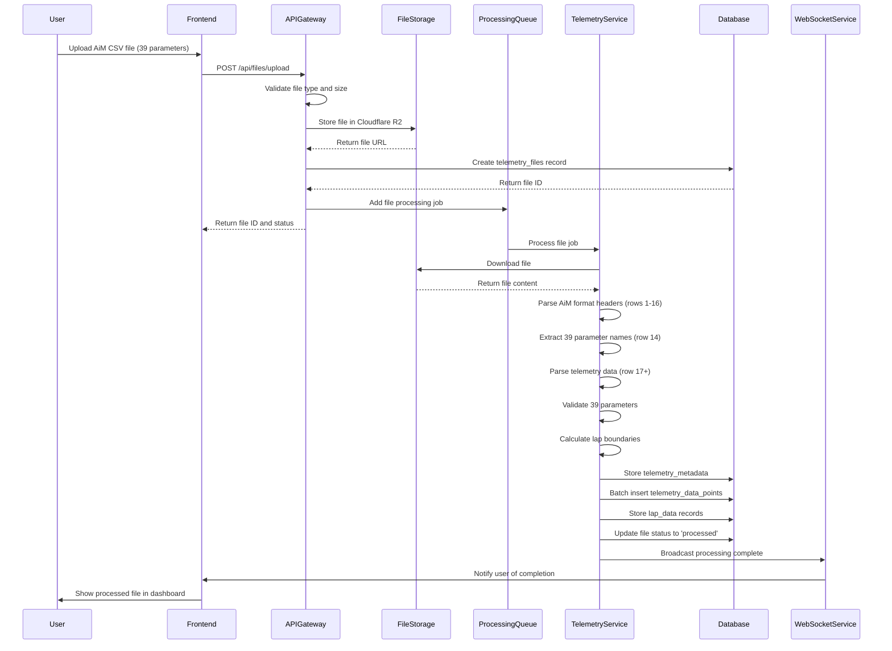
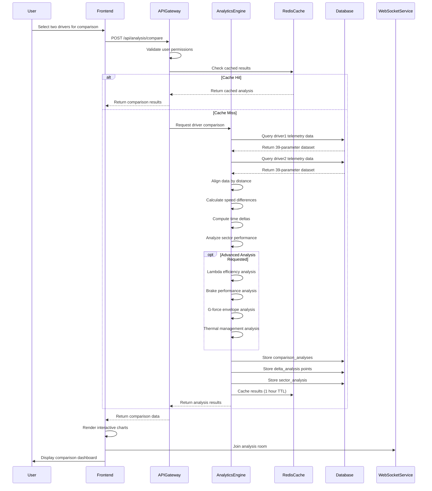
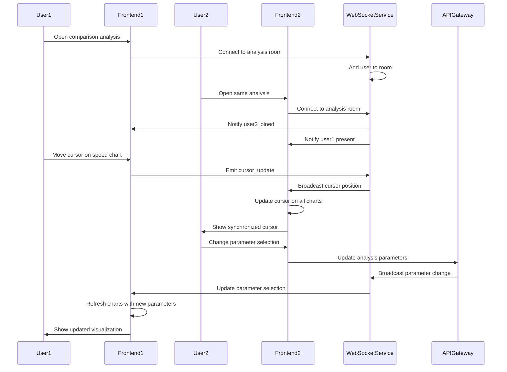
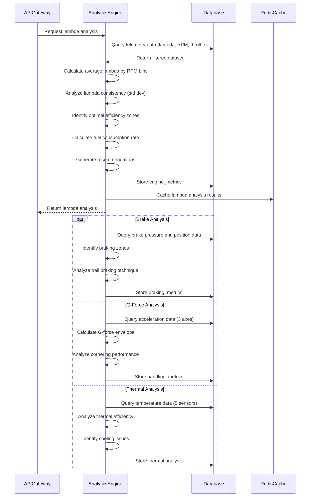

# Formula 4 Race Analytics Webapp - Complete System Architecture

**Version:** 2.0  
**Date:** June 21, 2025  
**Author:** Bob, System Architect  
**Based on:** Emma's PRD v2.0 and David's 39-Parameter Telemetry Analysis  

---

## Executive Summary

This document presents the complete system architecture for the Formula 4 Race Analytics Webapp, designed to handle 39-parameter telemetry data from AiM RaceStudio systems. The architecture supports professional-grade racing analytics with web-based accessibility, targeting 100+ concurrent users with sub-3-second response times.

**Key Architecture Decisions:**
- Microservices architecture with specialized telemetry processing
- React/TypeScript frontend with professional motorsport UI
- Node.js API gateway with Python analytics engine
- PostgreSQL with optimized 39-parameter schema
- Real-time WebSocket connections for collaborative analysis
- Containerized deployment with auto-scaling capabilities

---

## 1. Implementation Approach

### 1.1 System Overview

We will implement a **cloud-native microservices architecture** optimized for professional Formula 4 telemetry analysis:

**Frontend Stack:**
- React 18 with TypeScript for type safety and maintainability
- Shadcn-ui component library for consistent professional UI
- Tailwind CSS for responsive styling and rapid development
- Plotly.js for advanced 3D telemetry visualizations
- Zustand for lightweight state management

**Backend Stack:**
- Node.js/Express API Gateway for request routing and authentication
- Python FastAPI services for intensive telemetry processing
- PostgreSQL 15+ with optimized schema for 39-parameter data
- Redis for high-performance caching of analysis results
- WebSocket (Socket.io) for real-time collaborative features

**Infrastructure:**
- Supabase for managed PostgreSQL and authentication
- Cloudflare R2 for cost-effective file storage and global CDN
- Docker containers with Kubernetes orchestration
- Auto-scaling based on telemetry processing demands

### 1.2 Key Technical Challenges Addressed

1. **39-Parameter Data Processing**: Specialized parsers for AiM RaceStudio format
2. **High-Frequency Data Storage**: Optimized PostgreSQL schema with partitioning
3. **Real-Time Analysis**: Efficient algorithms for driver comparison calculations
4. **Collaborative Features**: WebSocket-based synchronized chart cursors
5. **Professional Visualization**: Advanced motorsport charts (Lambda, G-force, 3D track mapping)
6. **Scalability**: Microservices architecture supporting 100+ concurrent users

---

## 2. Data Structures and Interfaces

### 2.1 Core Data Models

```typescript
// Telemetry Data Point (39 Parameters)
interface TelemetryDataPoint {
  id: bigint;
  fileId: string;
  lapNumber: number;
  timestamp: number;
  
  // GPS Data (14 parameters)
  gpsSpeed: number;          // GPS Speed [km/h]
  gpsNsat: number;           // GPS Nsat (satellites)
  gpsLatAcc: number;         // GPS LatAcc [g]
  gpsLonAcc: number;         // GPS LonAcc [g]
  gpsSlope: number;          // GPS Slope [deg]
  gpsHeading: number;        // GPS Heading [deg]
  gpsGyro: number;           // GPS Gyro [deg/s]
  gpsAltitude: number;       // GPS Altitude [m]
  gpsPosAccuracy: number;    // GPS PosAccuracy [mm]
  gpsSpdAccuracy: number;    // GPS SpdAccuracy [km/h]
  gpsRadius: number;         // GPS Radius [m]
  gpsLatitude: number;       // GPS Latitude [deg]
  gpsLongitude: number;      // GPS Longitude [deg]
  
  // Engine Data (5 parameters)
  engineRpm: number;         // Engine RPM [rpm]
  vehicleSpeed: number;      // Speed [km/h]
  gear: number;              // Gear [gear]
  throttlePos: number;       // Throttle Pos [%]
  lambdaValue: number;       // Lambda [lambda]
  
  // Temperature Data (5 parameters)
  loggerTemp: number;        // LoggerTemp [°C]
  waterTemp: number;         // Water Temp [°C]
  headTemp: number;          // Head Temp [°C]
  exhaustTemp: number;       // Exhaust Temp [°C]
  oilTemp: number;           // Oil Temp [°C]
  
  // Pressure Systems (2 parameters)
  oilPress: number;          // Oil Press [bar]
  brakePress: number;        // Brake Press [bar]
  
  // Control Positions (3 parameters)
  brakePos: number;          // Brake Pos [%]
  clutchPos: number;         // Clutch Pos [%]
  steeringPos: number;       // Steering Pos [deg]
  
  // Acceleration Data (3 parameters)
  lateralAcc: number;        // Lateral Acc [g]
  inlineAcc: number;         // Inline Acc [g]
  verticalAcc: number;       // Vertical Acc [g]
  
  // Power and Fuel (3 parameters)
  battery: number;           // Battery [V]
  batteryVoltage: number;    // Battery Voltage [V]
  fuelLevel: number;         // Fuel Level [%]
  
  // Distance Tracking (2 parameters)
  distanceOnGpsSpeed: number;     // Distance on GPS Speed [m]
  distanceOnVehicleSpeed: number; // Distance on Vehicle Speed [m]
  
  // System Data (2 parameters)
  predictiveTime: number;         // Predictive Time
  predictiveTimeAlt: number;      // Alternative predictive time
}

// Telemetry File Management
interface TelemetryFile {
  id: string;
  fileName: string;
  fileSize: number;
  format: 'AiM_RaceStudio' | 'Generic_CSV';
  uploadedBy: string;
  teamId: string;
  status: 'uploaded' | 'processing' | 'processed' | 'error';
  uploadPath: string;
  processingLogs: string[];
  uploadedAt: Date;
  processedAt?: Date;
  metadata: TelemetryMetadata;
}

// Session Metadata from AiM Format
interface TelemetryMetadata {
  driverName: string;
  sessionType: string;       // e.g., 'MMSC Full'
  vehicle: string;           // e.g., 'Mygale F4 Spec 2'
  carNumber: number;
  championship: string;      // e.g., 'Formula 4 India'
  trackName: string;
  sessionDate: Date;
  sessionTime: string;
  totalLaps: number;
  fastestLapTime: number;
  beaconMarkers: number[];   // Track segment markers
  segmentTimes: string[];    // Sector times
  parameterCount: number;    // Should be 39
  dataStartRow: number;      // Row 17 for AiM format
}

// Advanced Analysis Results
interface ComparisonAnalysis {
  id: string;
  name: string;
  driver1FileId: string;
  driver2FileId: string;
  driver1Lap: number;
  driver2Lap: number;
  createdBy: string;
  totalTimeDifference: number;
  maxTimeGain: number;
  maxTimeLoss: number;
  speedComparison: SpeedComparisonData;
  deltaAnalysis: DeltaAnalysisPoint[];
  sectorAnalysis: SectorAnalysis[];
  advancedMetrics: AdvancedMetrics;
  createdAt: Date;
}

interface AdvancedMetrics {
  lambdaAnalysis: LambdaAnalysisData;
  brakingAnalysis: BrakingAnalysisData;
  gforceAnalysis: GForceAnalysisData;
  thermalAnalysis: ThermalAnalysisData;
  clutchAnalysis: ClutchAnalysisData;
}

// User and Team Management
interface User {
  id: string;
  email: string;
  name: string;
  role: 'driver' | 'engineer' | 'manager' | 'admin';
  teamId?: string;
  subscriptionTier: 'free' | 'professional' | 'team' | 'enterprise';
  createdAt: Date;
  lastLoginAt?: Date;
}

interface Team {
  id: string;
  name: string;
  ownerId: string;
  subscriptionTier: 'professional' | 'team' | 'enterprise';
  maxUsers: number;
  maxStorageGB: number;
  createdAt: Date;
  members: User[];
}
```

### 2.2 API Interface Definitions

```typescript
// File Upload API
interface FileUploadRequest {
  file: File;
  metadata: {
    driverName?: string;
    sessionType?: string;
    notes?: string;
  };
}

interface FileUploadResponse {
  success: boolean;
  fileId: string;
  message: string;
  processingStatus: 'queued' | 'processing' | 'completed';
}

// Telemetry Data Query API
interface TelemetryDataRequest {
  fileId: string;
  startTime?: number;
  endTime?: number;
  lap?: number;
  parameters?: string[];     // Subset of 39 parameters
  format?: 'json' | 'csv';
  compression?: boolean;
}

interface TelemetryDataResponse {
  fileId: string;
  dataPoints: TelemetryDataPoint[];
  parameterCount: number;
  timeRange: [number, number];
  lapInfo?: LapInfo;
  metadata: TelemetryMetadata;
}

// Driver Comparison API
interface ComparisonRequest {
  name: string;
  driver1: {
    fileId: string;
    lap: number;
  };
  driver2: {
    fileId: string;
    lap: number;
  };
  analysisType: 'basic' | 'advanced' | 'full';
  parameters?: string[];     // Specific parameters to analyze
  options?: {
    generateReport?: boolean;
    includeAdvancedMetrics?: boolean;
    saveToDashboard?: boolean;
  };
}

interface ComparisonResponse {
  comparisonId: string;
  driver1Info: DriverSessionInfo;
  driver2Info: DriverSessionInfo;
  basicMetrics: BasicComparisonMetrics;
  advancedMetrics?: AdvancedMetrics;
  visualizationData: VisualizationData;
  summary: AnalysisSummary;
  reportUrl?: string;
}

// Advanced Analysis APIs
interface LambdaAnalysisRequest {
  fileId: string;
  lap: number;
  rpmBins?: number[];
}

interface LambdaAnalysisResponse {
  averageLambda: number;
  lambdaConsistency: number;
  optimalZones: LambdaZone[];
  fuelEfficiencyScore: number;
  powerBandAnalysis: PowerBandData;
  recommendations: string[];
}

// Real-time Collaboration
interface WebSocketMessage {
  type: 'cursor_update' | 'analysis_complete' | 'user_joined' | 'user_left';
  analysisId: string;
  userId: string;
  data: any;
  timestamp: Date;
}
```

---

## 3. Program Call Flow

### 3.1 File Upload and Processing Flow



### 3.2 Driver Comparison Analysis Flow



### 3.3 Real-Time Collaboration Flow



### 3.4 Advanced Analytics Processing Flow



---

## 4. Anything UNCLEAR

### 4.1 Technical Clarifications Needed

**Real-Time Streaming Requirements:**
- **Question**: Should the system support live telemetry streaming during races, or focus on post-session analysis?
- **Impact**: Live streaming would require WebSocket connections to telemetry hardware and real-time processing capabilities
- **Recommendation**: Start with post-session analysis (P0) and add live streaming in Phase 2 (P1)

**Hardware Integration Priority:**
- **Question**: Which telemetry systems beyond AiM RaceStudio should be supported in MVP?
- **Current Support**: AiM RaceStudio format (39 parameters) fully implemented
- **Potential Extensions**: Marelli, MoTeC, generic CSV formats
- **Recommendation**: Focus on AiM format for MVP, add others based on customer demand

**Data Retention and Privacy:**
- **Question**: How long should telemetry data be retained, and what are the privacy requirements?
- **Considerations**: GDPR compliance, team data confidentiality, storage costs
- **Recommendation**: 1-year retention for paid users, 30 days for free tier, with explicit data deletion options

### 4.2 Business Logic Clarifications

**Subscription Tier Feature Mapping:**
- **Free Tier**: Basic comparison (2 drivers), 5 uploads/month, standard parameters only
- **Professional Tier**: Advanced analysis, unlimited uploads, all 39 parameters, PDF reports
- **Team Tier**: Multi-user collaboration, team dashboards, custom branding
- **Enterprise Tier**: White-label, custom integrations, dedicated support

**Performance Requirements Validation:**
- **Current Target**: Sub-3-second page loads, 99.9% uptime
- **Question**: Are these sufficient for professional racing team requirements?
- **Consideration**: Peak load during race weekends, international usage

### 4.3 Integration Requirements

**Supabase Integration:**
- **Authentication**: JWT tokens, social login, team management
- **Database**: PostgreSQL with 39-parameter optimized schema
- **Real-time**: Supabase Realtime for live collaboration features
- **Storage**: Supabase Storage vs Cloudflare R2 for telemetry files

**Third-Party Service Dependencies:**
- **File Storage**: Cloudflare R2 (primary) with S3 fallback
- **CDN**: Cloudflare for global asset delivery
- **Monitoring**: Application performance monitoring needs
- **Security**: SOC2 compliance requirements for professional racing data

### 4.4 Scalability Considerations

**Database Scaling Strategy:**
- **Current**: Single PostgreSQL instance with read replicas
- **Future**: Sharding by team_id for enterprise customers
- **Concern**: 39-parameter data growth rate with multiple teams

**Processing Queue Management:**
- **Current**: Redis-based job queue for file processing
- **Scaling**: Multiple worker instances for parallel processing
- **Priority**: VIP processing for paid subscribers

---

## 5. Next Steps and Implementation Roadmap

### 5.1 Immediate Implementation (Weeks 1-4)
1. Set up development environment with Docker containers
2. Implement PostgreSQL schema with 39-parameter structure
3. Create React frontend with shadcn/ui components
4. Build AiM RaceStudio CSV parser (Python)
5. Implement basic file upload and processing pipeline

### 5.2 Core Features (Weeks 5-12)
1. Driver comparison engine with speed and delta analysis
2. Interactive telemetry charts with synchronized cursors
3. User authentication and team management
4. Basic report generation and export functionality
5. WebSocket real-time collaboration features

### 5.3 Advanced Analytics (Weeks 13-24)
1. Lambda efficiency analysis implementation
2. Advanced braking performance metrics
3. G-force envelope and cornering analysis
4. Thermal management monitoring
5. 3D track mapping with GPS visualization

### 5.4 Production Deployment (Weeks 25-28)
1. Kubernetes cluster setup with auto-scaling
2. Production database optimization and monitoring
3. Security hardening and penetration testing
4. Performance testing with 100+ concurrent users
5. Go-live with beta customer group

This architecture provides a solid foundation for professional Formula 4 telemetry analysis while maintaining scalability for future enhancements and market expansion.